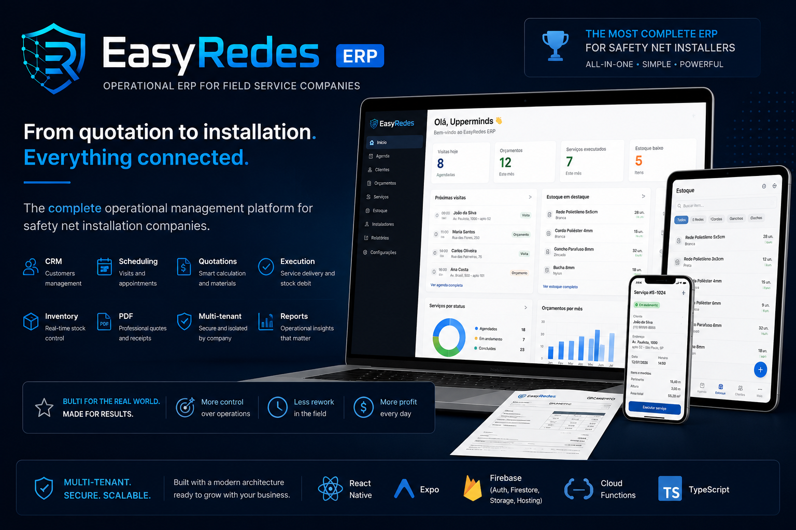
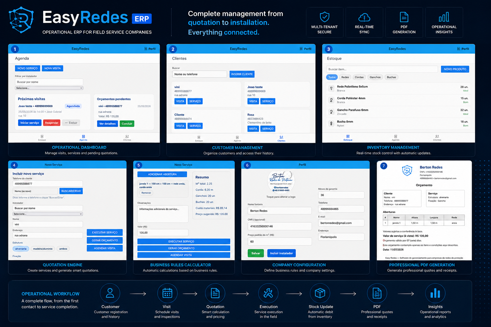

<p align="center">
  
</p>

<p align="center">


</p>

# 🛡 EasyRedes ERP

### Operational ERP built for safety net installation companies.

EasyRedes is a cross-platform ERP that centralizes the entire operational workflow of field service companies, from customer management and quotations to inventory control, scheduling, PDF generation and service execution.

Designed to replace spreadsheets and manual processes with a modern, cloud-native platform.

> **From quotation to installation. Everything connected.**

---

# 🎯 Business Problem

Small and medium-sized safety net installation companies commonly manage operations using spreadsheets, handwritten notes and disconnected tools.

This creates problems such as:

- Inventory inaccuracies
- Manual quotation errors
- Poor customer history
- Difficult scheduling
- No operational visibility
- Time wasted on repetitive tasks

EasyRedes was designed to digitalize the complete workflow through a single platform.

---

# 👨‍💻 My Role

I designed and developed the entire product from concept to production-ready architecture.

As Product Owner and Full Stack Developer I was responsible for:

- Product Discovery
- UX/UI Design
- Business Rules
- Software Architecture
- Mobile Development
- Web Development
- Firebase Infrastructure
- Authentication
- Firestore Data Modeling
- Cloud Functions
- PDF Generation
- Inventory Logic
- CRM
- Multi-tenant Architecture
- Security Rules
- Mercado Pago Integration
- Deployment

---

# 📱 Screenshots

<p align="center">
  
</p>

---

# ✨ Core Features

| Feature | Description |
|----------|-------------|
| 📅 Scheduling | Visit and quotation management |
| 👥 CRM | Customer registration and history |
| 📦 Inventory | Automatic stock control |
| 📄 PDF Generator | Professional quotations and receipts |
| 🧮 Smart Calculations | Material calculation based on business rules |
| ⚙ Service Execution | Automatic stock debit after completion |
| 🔒 Multi-tenant | Company-isolated data |
| ☁ Cloud Sync | Firebase real-time synchronization |
| 📱 Cross-platform | Android, Web and future iOS support |
| 💳 Subscription Ready | Mercado Pago integration prepared |

---

# 🏗 Architecture

```text
React Native (Expo)
        │
        ▼
Firebase Authentication
        │
        ▼
Cloud Firestore
        │
        ▼
Repositories
        │
        ▼
Business Rules
        │
        ▼
Cloud Functions
        │
        ▼
PDF Generation
        │
        ▼
Inventory & CRM
```

---

# 📊 Technical Highlights

- Multi-tenant architecture
- Firebase Security Rules
- Repository Pattern
- Context-based State Management
- Cloud Functions
- Offline-first cache
- Firestore Batch Operations
- Real-time synchronization
- PDF generation
- Responsive Web support
- Cross-platform architecture

---

# ⚙ Tech Stack

## Frontend

- React Native
- Expo
- Expo Router
- TypeScript
- NativeWind

## Backend

- Firebase Authentication
- Firestore
- Cloud Functions
- Storage
- Hosting

## Payments

- Mercado Pago

## Infrastructure

- Firebase Hosting
- Security Rules
- Cloud Storage

---

# 🚀 Technical Challenges

## Inventory Synchronization

Building an inventory system capable of automatically updating stock during service execution while keeping Firestore costs low.

---

## Business Rules

Implementing domain-specific calculations for safety net installation, including material estimation, labor costs and quotation generation.

---

## Multi-tenant Architecture

Keeping company data isolated while maintaining a simple Firestore structure.

---

## PDF Generation

Creating professional quotations and receipts directly from the application.

---

## Performance

Optimizing Firestore listeners, local cache and repository architecture to reduce reads and improve responsiveness.

---

# 📈 Why this project stands out

✅ Complete ERP workflow

✅ Production-ready architecture

✅ Multi-tenant SaaS

✅ Firebase Security Rules

✅ Automatic inventory management

✅ Professional PDF generation

✅ Cloud-native backend

✅ Cross-platform

✅ Responsive Web

✅ Scalable architecture

---

# 📚 What I Learned

EasyRedes was my most architecture-focused project.

Unlike consumer applications, building an ERP required translating real operational workflows into software while balancing usability, scalability and maintainability.

This project strengthened my understanding of domain modeling, data architecture, business rules and enterprise software design.

---

# 🔗 Repository Purpose

This repository is a **case study** showcasing the product architecture, business decisions and technical implementation behind EasyRedes.

The production source code remains private.

---

## ⭐ Building software that solves real operational problems.
